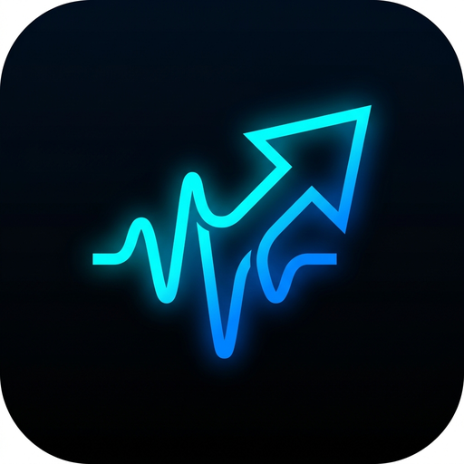

# 📱 MediaFetch for Android (Mobile Edition)

<div align="center">
  
  <br/>
  <h3>Apple-Grade Aesthetics • Zero-Waste Trimmer • 320k Audio • Share Sheet Integration</h3>
</div>

---

## ✨ Key Features

- **⚡ System Share Sheet Integration (Feature A)**: Direct URL interception via Android `ACTION_SEND` intent from YouTube, Instagram Reels, TikTok, Reddit, X / Twitter, and Chrome.
- **✂️ Zero-Waste Clip Range Trimmer (Feature B)**: Dual-mode input with manual timestamp typing (`MM:SS`) + dynamic range slider. Saves up to **98% mobile data** by requesting only the exact time range on download.
- **🎵 Instant Audio Extractor (Feature C)**: 1-Tap Studio Master MP3 (320 kbps), Lossless WAV, and Apple AAC (M4A) with auto-embedded ID3 tags and high-res cover artwork.
- **📊 Real-Time File Size Engine**: Displays pre-calculated and live Megabytes (`MB`) for 4K UHD, 2K QHD, 1080p, 720p, 480p, and audio formats before downloading.
- **📑 Playlist Batch Selector**: Multi-select track manager with "Select All", duration previews, and batch download queueing.
- **🖤 Human-Crafted Apple UI/UX**: Pure AMOLED Pitch Black (`#000000`) & Pristine Light (`#F8F9FA`) themes, frosted glass blur, smooth spring micro-interactions, and custom minimalist glyph icon.
- **🖼️ Android MediaStore & Gallery Sync**: Saves directly to `Downloads/MediaFetch` and syncs instantly with device Photos / Gallery.

---

## 🚀 Building & Installing

### Prerequisites
- Android SDK 34 (compileSdk 34, minSdk 24)
- JDK 17 or JDK 21
- Gradle 8.7

### Build Release APK
```bash
./gradlew assembleRelease
```

The compiled APK will be output to:
`mobile/app/build/outputs/apk/release/app-release.apk`
